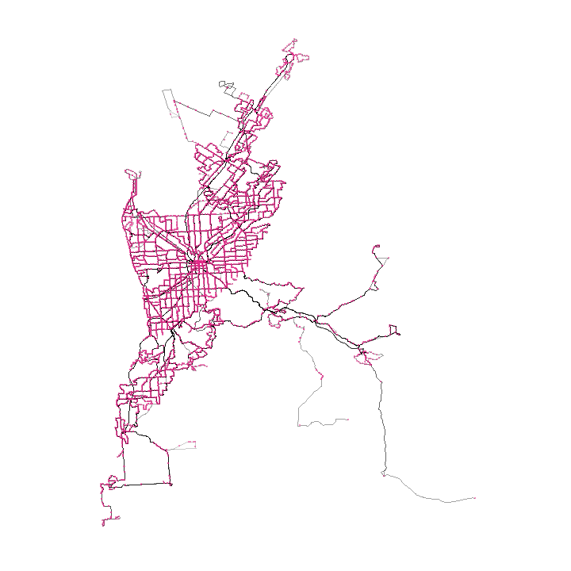

Exploring public trasnit data for Adelaide and surroundings
---------

Data source: http://adelaidemetro.com.au/GTFS/google_transit.zip from Adelaide Metro - Department of Planning Transport and Infrastructure, South Australia.

1. Transit routes
----------
Mapping all transit routes.

2. Stops
----------
Mapping all stops.

