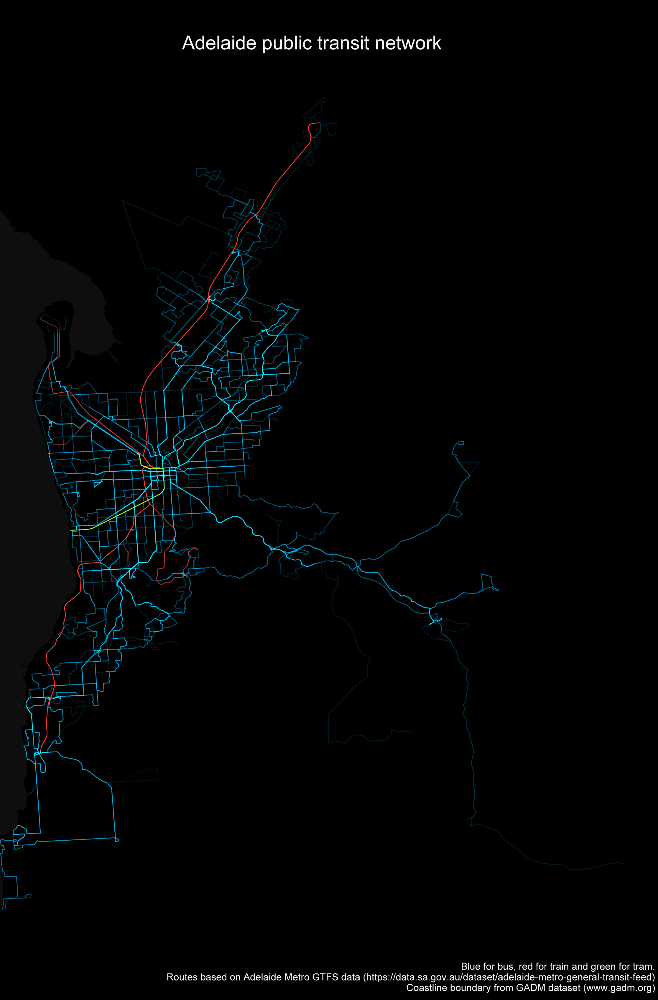
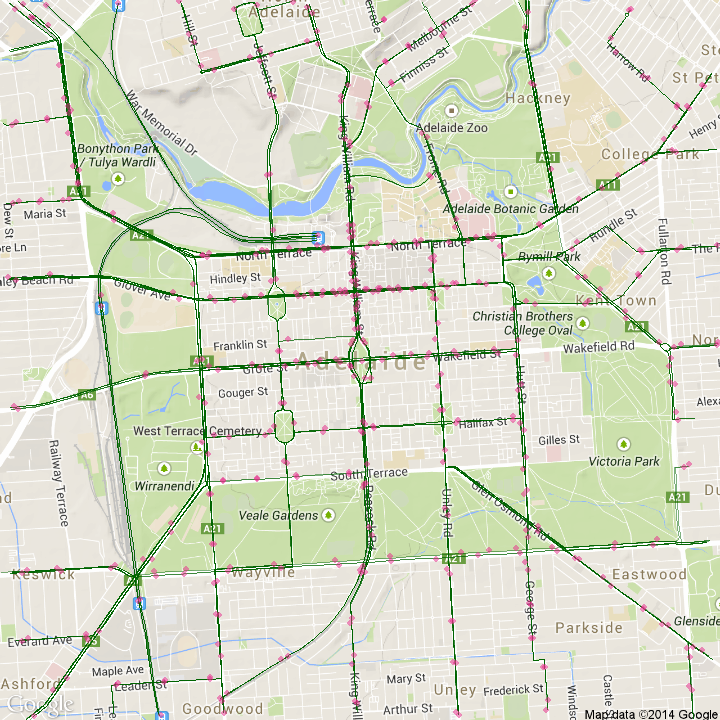

Exploring public trasnit data for Adelaide and surroundings
---------

GTFS data obtained under Creative Commons Attribution licence from https://data.sa.gov.au/dataset/adelaide-metro-general-transit-feed 

1. Transit routes
----------
Mapping all transit routes.
... 

2. Stops
----------
Mapping all stops.
...

2. Interactive maps
----------
...